# Ground Truth Segmentation with GAN Model

## Notes
Clone the project on your machine with :

```
git clone https://github.com/zakariamejdoul/ground-truth-gan-segmentation.git
```

## Behaviour

Image segmentation is an image processing operation that aims to group pixels together according to predefined criteria. The pixels are thus grouped into regions, which constitute a paving or a partition of the image.<br><br>
Generative adversarial networks (GANs) are a class of unsupervised learning algorithms. These algorithms were introduced by Goodfellow et al. 2014. They are used to generate images with a high degree of realism.
<br><br>In this project, we will apply the DCGAN approach for ground truth segmentation operation of satellite images.

## Dataset

The dataset used is AIRS ([Aerial Imagery for Roof Segmentation - Resized Version)](https://www.kaggle.com/atilol/resized-aerialimageryforroofsegmentation) is a public dataset that aims to compare roof segmentation algorithms from very high resolution aerial images. 
The main characteristics of AIRS can be summarized as follows:
* Coverage of 457 km2 of orthorectified aerial imagery with more than 220,000 buildings
* Very high spatial resolution of the imagery (0.075m)
* Refined ground truths that strictly align with the roof contours

To reduce processing time and given the limited resources we have, we opted for a resized version of the database from (10000px × 10000px × 3) to (1024px × 1024px × 3), and for the dimensional constraint of the Pix2Pix model input we resized all images and labels to (256px × 256px × 3). 
<br><br>Summary on the dataset: 
* Number of images: 875(train) + 95(test) + 94(validation)
* Image size: (256 × 256 × 3)
* Each folder contains the images and the roof labels

The following figure shows an example of an image with its label :

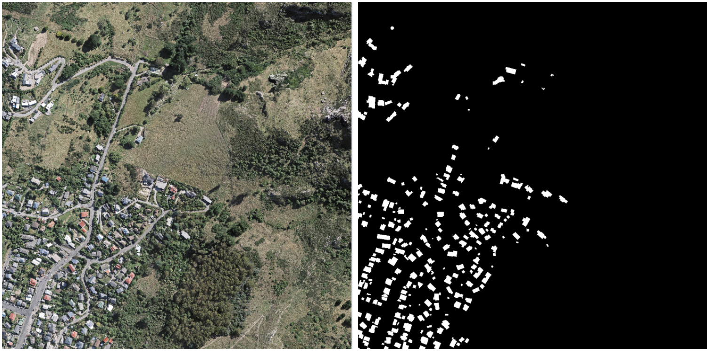

## Data Processing (Image Loading)

Data preprocessing is a data mining technique that is used to transform raw data into a useful and efficient format.
<br>In our case, the following processing was applied:
* Image loading: The `load_image()` function is used to load, resize, and separate the dataset (train, test, validation); each dataset subset contains the satellite images and their labels (grounds truth).
* Contour extraction: The function `Extract_Contour()` with image processing operations (erosion and dilation) extracts the contours of the labels (of the binary images) that represent the footprint of the buildings, and then draws the extracted contours on the binary images or the labels.

The following figure shows an example of an image with its contoured label :

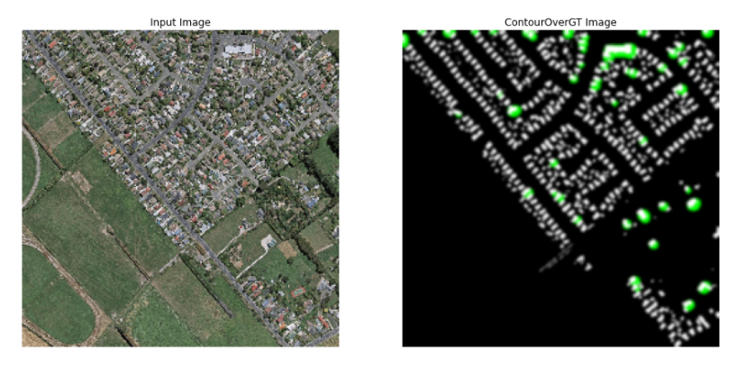

## Model Architecture

### Model based on Pix2Pix architecture

Pix2Pix is based on conditional generative adversarial networks (CGAN) to learn a mapping function that maps an input image into an output image. <br>Pix2Pix like GAN, CGAN is also composed of two networks, the generator and the discriminator. The figure below shows a very high level view of the Pix2Pix architecture:

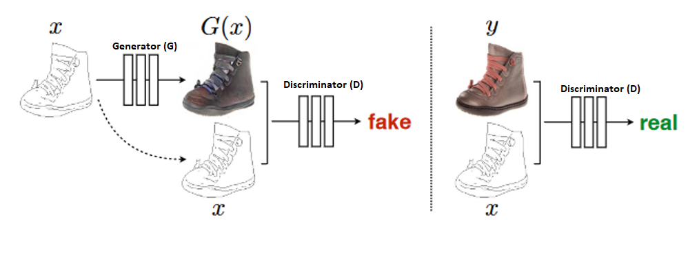

### The Generator Architecture

The purpose of the generator is to take an input image and convert it into the desired image (output or footprint) by implementing the necessary tasks. There are two types of generators, including the encoder-decoder and the U-Net. The final difference is to have skipped connections.
<br>Encoder-decoder networks translate and compress the input images into a low-dimensional vector presentation (Bottleneck). Then the process is reversed and the multitude of low-level information exchanged between the input and output can be used to execute all the necessary information through the network.<br>In order to bypass the Bottleneck part of the information, they added a hop connection between each layer i and n-i, where i is the total number of layers. Note that the shape of the generator with the hop connections looks like a U-Net. These images are shown below:

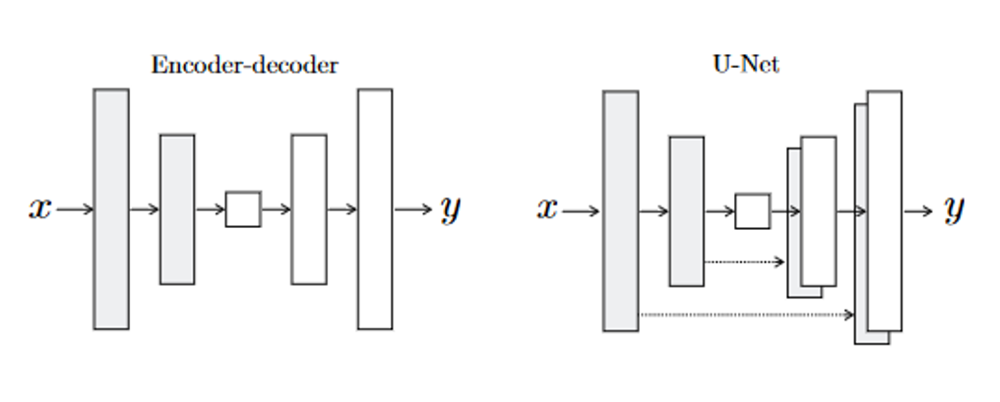

>**As can be seen in the U-Net architecture, information from earlier layers will be integrated into later layers and, thanks to the use of hop connections, they require no size changes or projections.**

### The Discriminator Architecture

The task of the discriminator is to measure the similarity of the input image with an unknown image. This unknown image belongs to the dataset (as a target image) or is an output image provided by the generator. The PatchGAN discriminator of the Pix2Pix network is used as a single component to classify the individual patches (N x N) of the image as real or fake. 
<br>As stated by the authors, since the number of parameters of the PatchGAN discriminator is very small, the classification of the entire image is faster. The architecture of the PatchGAN discriminator is shown in the figure below :

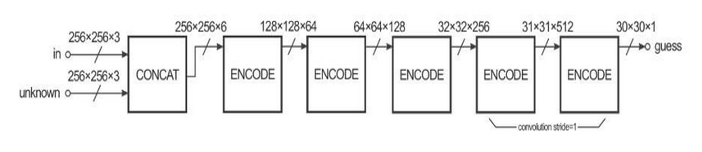

>**The reason this architecture is called "PatchGAN" is that each pixel in the output of the discriminator (30 × 30 image) corresponds to the 70×70 patch in the input image. It is also worth noting that since the size of the input images is 256×256, the patches overlap considerably.**

### The Training Strategy

After defining the dataset, the Pix2Pix network weights are adjusted in two steps:

1. In the first step, the discriminator (figure below) takes the input (satellite image)/target (ground truths with overlapping contours) and then input (satellite image)/output (generator output) pairs, to estimate their realism. Then, the adjustment of the discriminator weights is performed according to the classification error of the mentioned pairs.<br><br>
    
    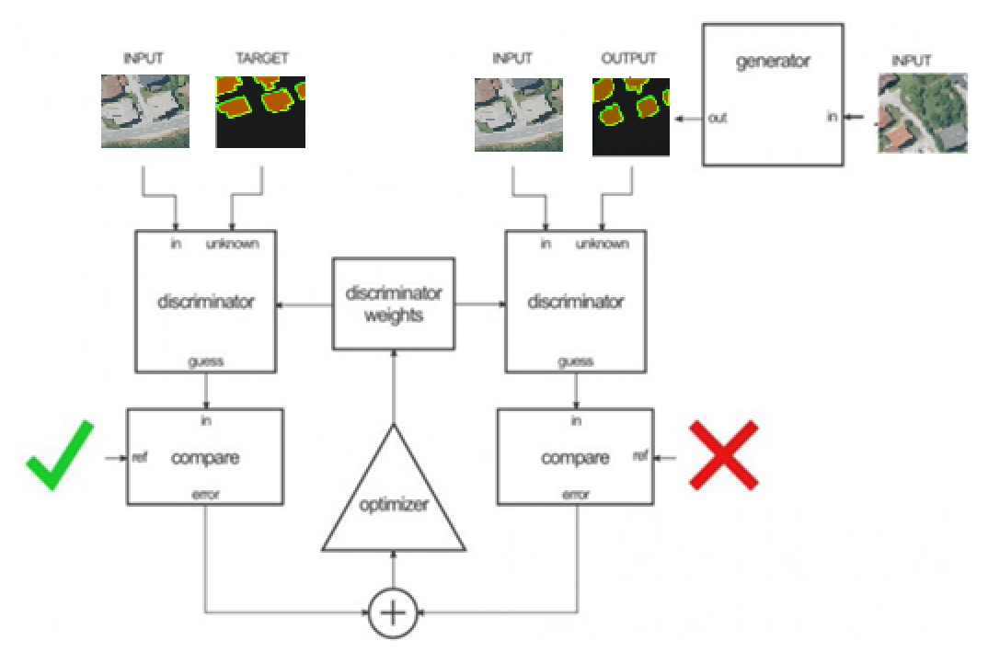
2. In the second step, the generator weights (figure below) are adjusted using the output of the discriminator and the difference between the output images and the target images.<br><br>

    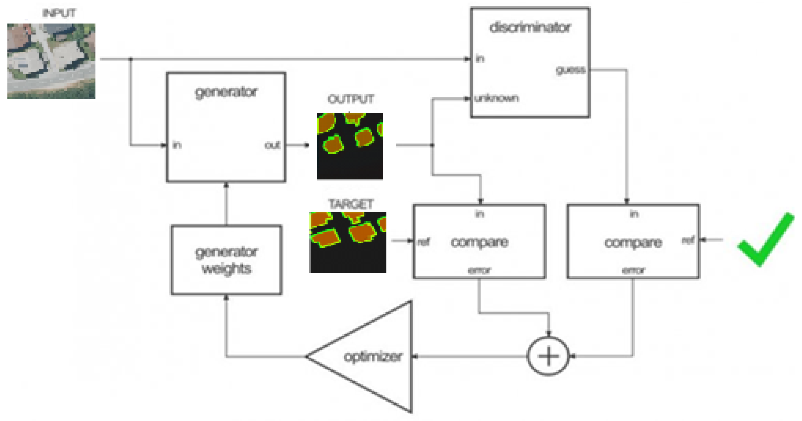

### Loss function and model optimizer

Gradually, with the help of an optimization function, the loss function learns to reduce the prediction error.
<br>In our case we used the following function:

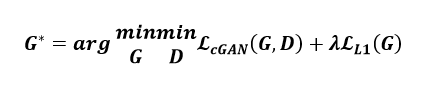

with:

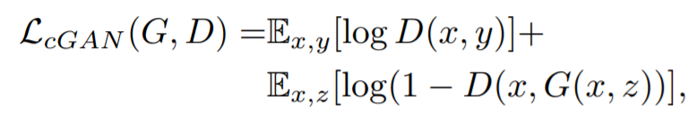
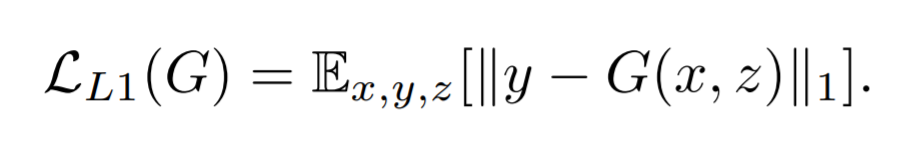

The method used to modify neural network attributes such as weights and learning rate to reduce losses is `Adam Optimizer` (Adaptive Moment Estimation) which works with first and second order impulses. The intuition behind Adam is that we don't want to drive so fast just because we can jump over the minimum, we want to decrease the speed a bit for a careful search. In addition to storing an exponentially decaying average of past gradients squared like AdaDelta, Adam also keeps an exponentially decaying average of past gradients M(t).

```
generator_optimizer = tf.train.AdamOptimizer(2e-4, beta1=0.5)
discriminator_optimizer = tf.train.AdamOptimizer(2e-4, beta1=0.5)
```
## Model Training

The training was applied on 875 images and spread over 50 epochs.
<br>After loading the data and building the model based on a generator and a discriminator, we call the function `train()` : the main model training loop which, after each epoch, displays the validation test by applying the current generation model on 15 batches from the validation dataset and displaying also the time that was necessary for the execution of the epoch in question, with a naked eye, we can see the progression of the generation of the segmentations or the labels of each satellite image as shown in the figures below :

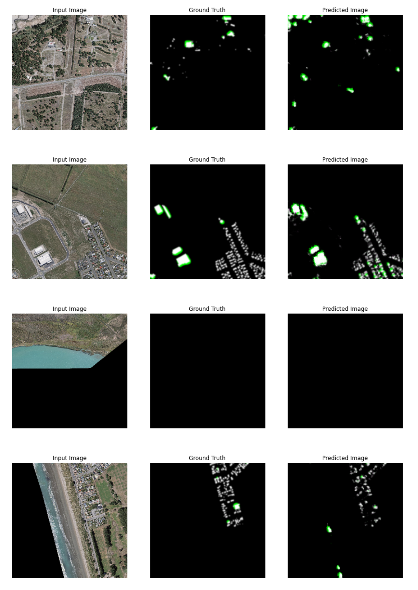
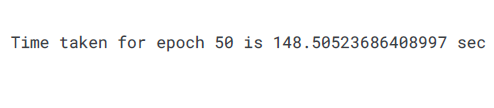

## Model Evaluation

While preparing the data and training a machine learning model is a key step in the machine learning pipeline, it is equally important to measure the performance of that trained model.


